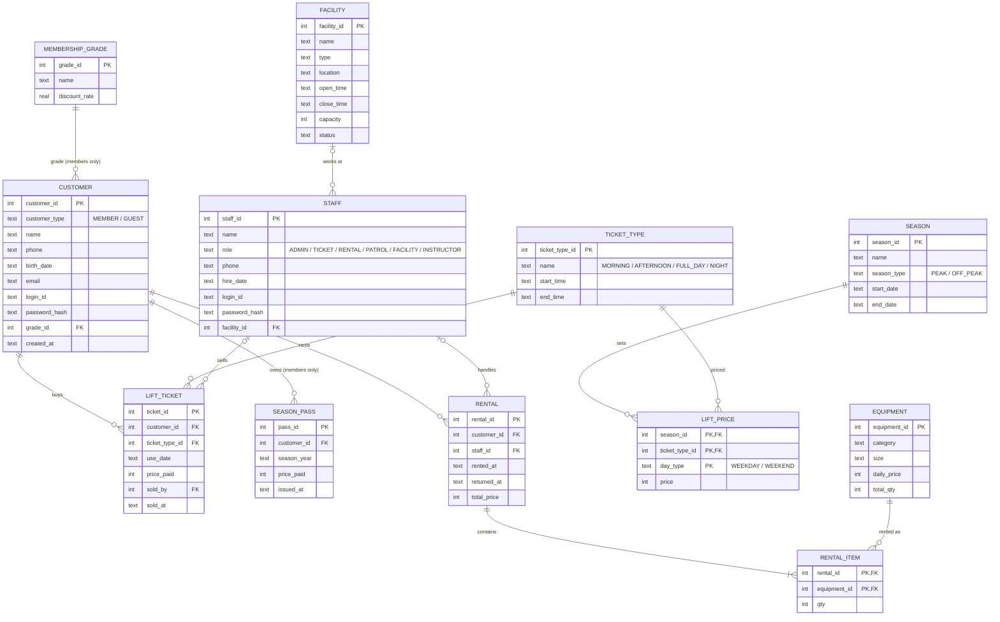

# Ski Resort ERD

```mermaid
erDiagram
    MEMBERSHIP_GRADE ||--o{ CUSTOMER : "grade (members only)"
    CUSTOMER ||--o{ LIFT_TICKET : buys
    CUSTOMER ||--o{ SEASON_PASS : "owns (members only)"
    CUSTOMER ||--o{ RENTAL : rents
    TICKET_TYPE ||--o{ LIFT_TICKET : "is of"
    SEASON ||--o{ LIFT_PRICE : sets
    TICKET_TYPE ||--o{ LIFT_PRICE : priced
    RENTAL ||--|{ RENTAL_ITEM : contains
    EQUIPMENT ||--o{ RENTAL_ITEM : "rented as"
    STAFF |o--o{ LIFT_TICKET : sells
    STAFF |o--o{ RENTAL : handles
    FACILITY |o--o{ STAFF : "works at"

    MEMBERSHIP_GRADE {
        int grade_id PK
        text name
        real discount_rate
    }
    CUSTOMER {
        int customer_id PK
        text customer_type "MEMBER / GUEST"
        text name
        text phone
        text birth_date
        text email
        text login_id
        text password_hash
        int grade_id FK
        text created_at
    }
    SEASON {
        int season_id PK
        text name
        text season_type "PEAK / OFF_PEAK"
        text start_date
        text end_date
    }
    TICKET_TYPE {
        int ticket_type_id PK
        text name "MORNING / AFTERNOON / FULL_DAY / NIGHT"
        text start_time
        text end_time
    }
    LIFT_PRICE {
        int season_id PK,FK
        int ticket_type_id PK,FK
        text day_type PK "WEEKDAY / WEEKEND"
        int price
    }
    LIFT_TICKET {
        int ticket_id PK
        int customer_id FK
        int ticket_type_id FK
        text use_date
        int price_paid
        int sold_by FK
        text sold_at
    }
    SEASON_PASS {
        int pass_id PK
        int customer_id FK
        text season_year
        int price_paid
        text issued_at
    }
    EQUIPMENT {
        int equipment_id PK
        text category
        text size
        int daily_price
        int total_qty
    }
    RENTAL {
        int rental_id PK
        int customer_id FK
        int staff_id FK
        text rented_at
        text returned_at
        int total_price
    }
    RENTAL_ITEM {
        int rental_id PK,FK
        int equipment_id PK,FK
        int qty
    }
    STAFF {
        int staff_id PK
        text name
        text role "ADMIN / TICKET / RENTAL / PATROL / FACILITY / INSTRUCTOR"
        text phone
        text hire_date
        text login_id
        text password_hash
        int facility_id FK
    }
    FACILITY {
        int facility_id PK
        text name
        text type
        text location
        text open_time
        text close_time
        int capacity
        text status
    }
```

Views: `equipment_stock` (available quantity), `customer_masked` (masked personal data + season pass flag).
